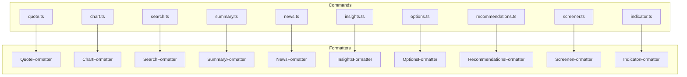

# Output Refactoring Plan: Decentralized ASCII Table Formatters

## Overview

Refactor the output system to support ASCII table formatting using `console-table-printer`, with each subcommand having its own dedicated formatter instead of a centralized one.

## Current State

- Single centralized [`OutputFormatter`](src/utils/output.ts:7) class in [`src/utils/output.ts`](src/utils/output.ts)
- Only supports JSON output (table support marked as TODO)
- All 10 commands use the same generic formatter

## Target Architecture



## File Structure

```
src/
├── formatters/
│   ├── index.ts          # Formatter registry and factory
│   ├── types.ts          # Shared types and interfaces
│   ├── quote.ts          # Quote data formatter
│   ├── chart.ts          # Chart/historical data formatter
│   ├── search.ts         # Search results formatter
│   ├── summary.ts        # Quote summary formatter
│   ├── news.ts           # News articles formatter
│   ├── insights.ts       # Insights formatter
│   ├── options.ts        # Options chain formatter
│   ├── recommendations.ts # Analyst recommendations formatter
│   ├── screener.ts       # Screener results formatter
│   └── indicator.ts      # Technical indicators formatter
├── commands/
│   └── ...               # Updated to use specific formatters
└── utils/
    └── output.ts         # Simplified or removed
```

## Implementation Details

### 1. Base Formatter Interface

```typescript
// src/formatters/types.ts
export interface FormatterOptions {
  table?: boolean;
  pretty?: boolean;
}

export interface DataFormatter<T> {
  format(data: T, options: FormatterOptions): string;
  formatJson(data: T, pretty: boolean): string;
  formatTable(data: T): string;
}
```

### 2. Formatter Pattern

Each formatter will follow this pattern:

```typescript
// Example: src/formatters/quote.ts
import { Table } from 'console-table-printer';
import type { DataFormatter, FormatterOptions } from './types';

export interface QuoteData {
  quotes: Array<{
    symbol: string;
    regularMarketPrice?: number;
    regularMarketChange?: number;
    // ... other fields
  }>;
}

export class QuoteFormatter implements DataFormatter<QuoteData> {
  format(data: QuoteData, options: FormatterOptions): string {
    if (options.table) {
      return this.formatTable(data);
    }
    return this.formatJson(data, options.pretty ?? true);
  }

  formatJson(data: QuoteData, pretty: boolean): string {
    return JSON.stringify(data, null, pretty ? 2 : 0);
  }

  formatTable(data: QuoteData): string {
    const table = new Table({
      columns: [
        { name: 'symbol', title: 'Symbol' },
        { name: 'price', title: 'Price' },
        { name: 'change', title: 'Change' },
        { name: 'changePercent', title: 'Change %' },
      ],
    });

    for (const quote of data.quotes) {
      table.addRow({
        symbol: quote.symbol,
        price: quote.regularMarketPrice?.toFixed(2) ?? 'N/A',
        change: quote.regularMarketChange?.toFixed(2) ?? 'N/A',
        changePercent: this.formatPercent(quote.regularMarketChangePercent),
      });
    }

    return table.render();
  }

  private formatPercent(value?: number): string {
    if (value === undefined) return 'N/A';
    return `${value >= 0 ? '+' : ''}${value.toFixed(2)}%`;
  }
}
```

### 3. Table Designs by Command

| Command | Table Columns | Notes |
|---------|---------------|-------|
| **quote** | Symbol, Price, Change, Change %, Volume | Simple one-row-per-symbol |
| **chart** | Date, Open, High, Low, Close, Volume | May limit rows for large datasets |
| **search** | Symbol, Name, Exchange, Type | Shows matching symbols |
| **summary** | Field, Value | Key-value pairs for summary data |
| **news** | Title, Publisher, Date | Truncate long titles |
| **insights** | Metric, Value | Summary of key insight metrics |
| **options** | Strike, Bid, Ask, Volume, OI | Separate tables for calls/puts |
| **recommendations** | Period, Strong Buy, Buy, Hold, Sell, Strong Sell | Analyst ratings |
| **screener** | Symbol, Name, Price, Change | Top results from screener |
| **indicator** | Date, Value | Or MACD/Signal/Histogram for MACD |

### 4. Complex Data Handling

For complex nested data, formatters will show **summary info only**:

- **Options**: Separate tables for calls and puts, showing key columns
- **Indicator**: Single table with relevant columns based on indicator type
- **Summary**: Key-value table format for selected modules
- **Insights**: Flattened summary of key metrics

### 5. Command Integration

Each command will import and use its specific formatter:

```typescript
// src/commands/quote.ts
import { QuoteFormatter } from '../formatters/quote';

// In action handler:
const formatter = new QuoteFormatter();
const output = formatter.format({ quotes }, options);
console.log(output);
```

## Dependencies

Add to `package.json`:
```json
"console-table-printer": "^2.12.0"
```

## Migration Steps

1. Install `console-table-printer` dependency
2. Create `src/formatters/types.ts` with base interfaces
3. Create `src/formatters/index.ts` with formatter registry
4. Implement each formatter one by one
5. Update each command to use its specific formatter
6. Remove or simplify `src/utils/output.ts`
7. Update exports

## Benefits

- **Separation of Concerns**: Each formatter handles its own data structure
- **Testability**: Formatters can be unit tested independently
- **Extensibility**: Easy to add new formatters for new commands
- **Maintainability**: Changes to one formatter don't affect others
- **Type Safety**: Each formatter is typed for its specific data

## Example Output

### Quote Table
```
┌─────────┬─────────┬─────────┬───────────┐
│ Symbol  │ Price   │ Change  │ Change %  │
├─────────┼─────────┼─────────┼───────────┤
│ AAPL    │ 178.72  │ +2.34   │ +1.33%    │
│ MSFT    │ 378.91  │ -1.23   │ -0.32%    │
└─────────┴─────────┴─────────┴───────────┘
```

### Options Table (Calls)
```
┌─────────┬─────────┬─────────┬────────┬───────┐
│ Strike  │ Bid     │ Ask     │ Volume │ OI    │
├─────────┼─────────┼─────────┼────────┼───────┤
│ 175.00  │ 4.20    │ 4.30    │ 1,234  │ 5,678 │
│ 180.00  │ 1.50    │ 1.60    │ 2,456  │ 3,210 │
└─────────┴─────────┴─────────┴────────┴───────┘
```

### Indicator Table (RSI)
```
┌────────────┬─────────┐
│ Date       │ RSI     │
├────────────┼─────────┤
│ 2024-02-15 │ 65.43   │
│ 2024-02-16 │ 68.21   │
│ 2024-02-17 │ 71.05   │
└────────────┴─────────┘
```
