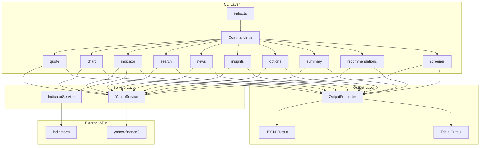
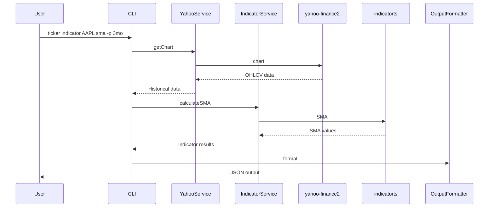

# Ticker CLI - Architecture Plan

## Overview

A command-line interface for trading analysis that provides stock quotes, charts, technical indicators, news, insights, and more using yahoo-finance2 and indicatorts libraries.

## Requirements Summary

| Feature | Details |
|---------|---------|
| Runtime | Bun |
| CLI Framework | Commander.js |
| Data Source | yahoo-finance2 |
| Indicators | indicatorts |
| Output Format | JSON (default), Table (with --table flag) |
| Date Range | Preset periods + custom date ranges |

## Project Structure

```
ticker-cli/
├── index.ts                 # Entry point, CLI setup
├── package.json
├── tsconfig.json
├── README.md
├── CLAUDE.md
└── src/
    ├── commands/            # CLI command handlers
    │   ├── quote.ts         # Stock quote command
    │   ├── chart.ts         # Chart/historical data command
    │   ├── indicator.ts     # Technical indicators command
    │   ├── news.ts          # News command
    │   ├── insights.ts      # Insights command
    │   ├── options.ts       # Options chain command
    │   ├── summary.ts       # Quote summary command
    │   ├── recommendations.ts # Recommendations command
    │   ├── screener.ts      # Stock screener command
    │   ├── search.ts        # Symbol search command
    │   └── index.ts         # Command exports
    ├── services/            # Business logic layer
    │   ├── yahoo.ts         # yahoo-finance2 wrapper
    │   ├── indicators.ts    # indicatorts wrapper
    │   └── index.ts         # Service exports
    ├── utils/               # Utility functions
    │   ├── output.ts        # JSON/table formatting
    │   ├── validation.ts    # Input validation
    │   ├── date.ts          # Date parsing utilities
    │   └── index.ts         # Utility exports
    └── types/               # TypeScript type definitions
        ├── quote.ts         # Quote types
        ├── indicator.ts     # Indicator types
        ├── chart.ts         # Chart data types
        ├── news.ts          # News types
        ├── insights.ts      # Insights types
        ├── options.ts       # Options types
        ├── summary.ts       # Summary types
        └── index.ts         # Type exports
```

## CLI Command Design

### Global Options

```
ticker <command> [options]

Options:
  --table          Output in table format instead of JSON
  --pretty         Pretty print JSON output
  -h, --help       Show help
  -V, --version    Show version
```

### Commands

#### 1. quote - Get stock quote

```bash
ticker quote <symbol>

# Examples:
ticker quote AAPL                    # Get Apple quote
ticker quote AAPL MSFT GOOGL         # Get multiple quotes
ticker quote AAPL --table            # Output as table
```

**Output (JSON):**
```json
{
  "symbol": "AAPL",
  "price": 178.52,
  "change": 2.34,
  "changePercent": 1.33,
  "bid": 178.50,
  "ask": 178.55,
  "volume": 52340000,
  "avgVolume": 52000000,
  "marketCap": 2780000000000,
  "pe": 28.5,
  "open": 176.00,
  "high": 179.00,
  "low": 175.80,
  "previousClose": 176.18,
  "timestamp": "2026-02-17T21:00:00Z"
}
```

#### 2. chart - Get chart/historical data

```bash
ticker chart <symbol> [options]

Options:
  -p, --period <period>     Preset period: 1d, 5d, 1w, 1mo, 3mo, 6mo, 1y, 2y, 5y
  -s, --start <date>        Start date (YYYY-MM-DD)
  -e, --end <date>          End date (YYYY-MM-DD)
  -i, --interval <interval> Interval: 1m, 5m, 15m, 30m, 1h, 1d, 1w, 1mo
  --include-timestamps      Include timestamps in output
  --include-pre-post        Include pre/post market data

# Examples:
ticker chart AAPL --period 1mo              # Last month
ticker chart AAPL --start 2025-01-01 --end 2025-12-31  # Custom range
ticker chart AAPL --period 1y --interval 1w # Weekly data for 1 year
ticker chart AAPL -p 3mo --table            # Last 3 months as table
```

**Output (JSON):**
```json
{
  "symbol": "AAPL",
  "period": "1mo",
  "interval": "1d",
  "data": [
    {
      "date": "2026-02-17",
      "open": 176.00,
      "high": 179.00,
      "low": 175.80,
      "close": 178.52,
      "volume": 52340000,
      "adjClose": 178.52
    }
  ]
}
```

#### 3. news - Get stock news

```bash
ticker news <symbol> [options]

Options:
  -l, --limit <number>      Number of news articles (default: 10)

# Examples:
ticker news AAPL                    # Get Apple news
ticker news AAPL --limit 20         # Get 20 news articles
ticker news AAPL --table            # Output as table
```

**Output (JSON):**
```json
{
  "symbol": "AAPL",
  "news": [
    {
      "title": "Apple Reports Q1 Results",
      "publisher": "Reuters",
      "link": "https://...",
      "published": "2026-02-17T10:30:00Z",
      "summary": "Apple Inc. reported..."
    }
  ]
}
```

#### 4. insights - Get stock insights

```bash
ticker insights <symbol>

# Examples:
ticker insights AAPL                # Get Apple insights
ticker insights TSLA --table        # Output as table
```

**Output (JSON):**
```json
{
  "symbol": "AAPL",
  "insights": {
    "instrumentInfo": {
      "technicalEvents": "bullish",
      "valuation": "fair"
    },
    "companySnapshot": {
      "sector": "Technology",
      "industry": "Consumer Electronics"
    }
  }
}
```

#### 5. options - Get options chain

```bash
ticker options <symbol> [options]

Options:
  -d, --date <date>         Expiration date (YYYY-MM-DD)
  --calls                   Show only calls
  --puts                    Show only puts

# Examples:
ticker options AAPL                        # Get nearest expiration
ticker options AAPL --date 2026-03-21      # Specific expiration
ticker options AAPL --calls --table        # Only calls as table
```

**Output (JSON):**
```json
{
  "symbol": "AAPL",
  "expirationDate": "2026-03-21",
  "calls": [
    {
      "strike": 175,
      "lastPrice": 5.20,
      "bid": 5.15,
      "ask": 5.25,
      "volume": 1500,
      "openInterest": 5200,
      "impliedVolatility": 0.25
    }
  ],
  "puts": [...]
}
```

#### 6. summary - Get quote summary

```bash
ticker summary <symbol> [options]

Options:
  -m, --modules <modules>   Comma-separated modules to include

Available Modules:
  summaryProfile, summaryDetail, defaultKeyStatistics, earnings,
  earningsTrend, financials, cashflowStatementHistory,
  balanceSheetHistory, incomeStatementHistory, recommendationTrend

# Examples:
ticker summary AAPL                           # Full summary
ticker summary AAPL --modules summaryProfile  # Specific module
ticker summary AAPL --table                   # Output as table
```

**Output (JSON):**
```json
{
  "symbol": "AAPL",
  "summaryProfile": {
    "sector": "Technology",
    "industry": "Consumer Electronics",
    "description": "Apple Inc. designs...",
    "website": "https://www.apple.com",
    "employees": 164000
  },
  "summaryDetail": {
    "marketCap": 2780000000000,
    "peRatio": 28.5,
    "dividendYield": 0.0052
  }
}
```

#### 7. recommendations - Get analyst recommendations

```bash
ticker recommendations <symbol>

# Examples:
ticker recommendations AAPL         # Get Apple recommendations
ticker recommendations TSLA --table # Output as table
```

**Output (JSON):**
```json
{
  "symbol": "AAPL",
  "recommendedSymbols": [
    { "symbol": "MSFT", "score": 0.85 },
    { "symbol": "GOOGL", "score": 0.78 }
  ]
}
```

#### 8. screener - Screen stocks

```bash
ticker screener [options]

Options:
  -q, --query <query>       Predefined screener query
  --custom <json>           Custom screener criteria as JSON

Predefined Queries:
  most_actives, day_gainers, day_losers, undervalued_growth_stocks,
  undervalued_large_caps, growth_technology_stocks, top_mutual_funds

# Examples:
ticker screener --query most_actives           # Most active stocks
ticker screener --query day_gainers --table    # Day gainers as table
```

**Output (JSON):**
```json
{
  "query": "most_actives",
  "quotes": [
    {
      "symbol": "NVDA",
      "name": "NVIDIA Corporation",
      "price": 850.25,
      "change": 12.50,
      "changePercent": 1.49,
      "volume": 125000000
    }
  ]
}
```

#### 9. search - Search for symbols

```bash
ticker search <query> [options]

Options:
  --quotes                  Include quotes in results
  --news                    Include news in results

# Examples:
ticker search apple                 # Search for Apple
ticker search "micro soft"          # Search with space
ticker search tesla --quotes        # Include quotes
```

**Output (JSON):**
```json
{
  "query": "apple",
  "quotes": [
    {
      "symbol": "AAPL",
      "name": "Apple Inc.",
      "exchange": "NASDAQ",
      "type": "EQUITY"
    }
  ]
}
```

#### 10. indicator - Calculate technical indicators

```bash
ticker indicator <symbol> <indicator> [options]

Indicators:
  sma              Simple Moving Average
  ema              Exponential Moving Average
  rsi              Relative Strength Index
  macd             MACD (Moving Average Convergence Divergence)
  bb               Bollinger Bands

Options:
  -p, --period <period>     Preset period for historical data
  -s, --start <date>        Start date
  -e, --end <date>          End date
  --length <number>         Period length for SMA/EMA (default: 20)
  --short <number>          Short period for MACD (default: 12)
  --long <number>           Long period for MACD (default: 26)
  --signal <number>         Signal period for MACD (default: 9)
  --stddev <number>         Standard deviation for BB (default: 2)

# Examples:
ticker indicator AAPL sma --length 20 -p 3mo       # 20-day SMA
ticker indicator AAPL ema --length 12 -p 3mo       # 12-day EMA
ticker indicator AAPL rsi -p 3mo                   # RSI with default 14
ticker indicator AAPL macd -p 6mo                  # MACD
ticker indicator AAPL bb --length 20 -p 3mo        # Bollinger Bands
ticker indicator AAPL sma --length 50 -p 1y --table
```

**Output (JSON) - SMA:**
```json
{
  "symbol": "AAPL",
  "indicator": "SMA",
  "length": 20,
  "data": [
    { "date": "2026-02-17", "value": 175.50 }
  ]
}
```

**Output (JSON) - MACD:**
```json
{
  "symbol": "AAPL",
  "indicator": "MACD",
  "config": { "short": 12, "long": 26, "signal": 9 },
  "data": [
    {
      "date": "2026-02-17",
      "macd": 2.34,
      "signal": 1.89,
      "histogram": 0.45
    }
  ]
}
```

**Output (JSON) - Bollinger Bands:**
```json
{
  "symbol": "AAPL",
  "indicator": "BollingerBands",
  "config": { "length": 20, "stddev": 2 },
  "data": [
    {
      "date": "2026-02-17",
      "upper": 182.50,
      "middle": 175.50,
      "lower": 168.50
    }
  ]
}
```

## Architecture Diagram



## Data Flow



## Dependencies

```json
{
  "dependencies": {
    "commander": "^12.0.0",
    "yahoo-finance2": "^2.11.0",
    "indicatorts": "^0.5.0"
  },
  "devDependencies": {
    "@types/bun": "latest",
    "typescript": "^5"
  }
}
```

## Implementation Priority

### Phase 1 - Core Infrastructure
1. Set up project structure and dependencies
2. Create CLI entry point with Commander.js
3. Implement output formatter utility (JSON/table)
4. Create YahooService with basic quote functionality

### Phase 2 - Essential Commands
5. Implement `quote` command
6. Implement `chart` command with period and date range options
7. Implement `search` command
8. Implement `summary` command with module selection

### Phase 3 - Additional Data Commands
9. Implement `news` command
10. Implement `insights` command
11. Implement `options` command with expiration date selection
12. Implement `recommendations` command
13. Implement `screener` command with predefined queries

### Phase 4 - Technical Indicators
14. Create IndicatorService
15. Implement SMA indicator
16. Implement EMA indicator
17. Implement RSI indicator
18. Implement MACD indicator
19. Implement Bollinger Bands indicator

### Phase 5 - Polish
20. Add comprehensive error handling
21. Add input validation
22. Improve table output formatting
23. Add help documentation
24. Write README with usage examples

## Error Handling Strategy

- Invalid symbol: Return error message with suggestion to use search
- Invalid date range: Return error with valid format hint
- Network errors: Retry with exponential backoff
- Rate limiting: Queue requests and inform user

## File Naming Conventions

- Use kebab-case for file names
- Use PascalCase for TypeScript interfaces/types
- Use camelCase for functions and variables
- One main export per file where practical
